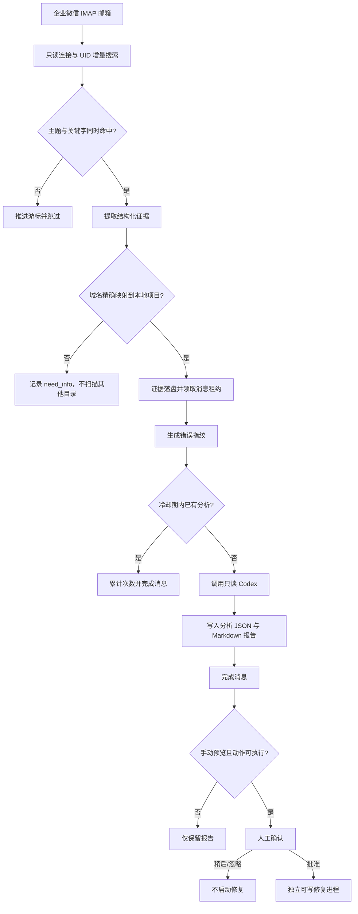

# 内网报错邮件分析

BugMail 是一个运行在 Windows 本机上的只读邮件分析工具。它通过企业微信 IMAP 邮箱领取符合条件的内网报错邮件，提取域名、接口、SQL 和代码上下文，将邮件域名精确映射到本地项目，再调用只读 Codex 生成根因分析报告。

## 安全边界

- 邮件使用 IMAP 只读模式。
- 密码只保存在 Windows 凭据管理器。
- 邮件正文视为不可信输入，不执行正文里的命令。
- 分析范围限制在域名映射到的项目。
- 计划任务只做只读分析和报告生成；识别到可处理问题时弹窗等待人工决定。
- 只有人工点击批准后，才会启动独立可写修复进程。
- 修复进程禁止连接线上数据库或部署。

## 当前能力

- 只读 IMAP 连接，不修改邮件状态。
- 主题命中“内网报错”或 `GS Error`，并且主题、发件人或正文命中配置关键字。
- 支持纯文本、HTML 和转发邮件正文。
- 提取域名、URL 查询参数、CH、Opt、SQL 错误码、表、字段和 `LastIncludedFile`。
- 使用 `UIDVALIDITY + UID` 作为邮箱增量边界；首次运行只初始化当前边界，不回补历史邮件。
- 从 phpStudy vhost 的 `ServerName`、`ServerAlias`、`DocumentRoot` 读取域名映射，也支持精确覆盖项。
- 一个邮件映射到多个不同项目时拒绝任意选择，输出 `need_info`。
- 相同错误指纹在默认 6 小时内只分析一次，重复邮件累计出现次数。
- 分析失败会释放租约，从本地证据队列重试。
- 计划任务识别到 `code_change`、`database_change` 或 `config_change` 时显示确认窗口；`no_change` 和 `need_info` 静默保存报告。

## 工作流程



### 邮件筛选

两组条件必须同时满足：

1. 主题至少命中一个 `filters.subject_contains`。
2. 发件人、主题、转发头或正文至少命中一个 `filters.keyword`。

通过筛选后还必须提取出已配置的域名。未知域名不会触发全盘搜索，也不会把相似的 `.com`、`.cn` 域名自动视为同一项目。

### 项目选择

- 多个域名解析到同一个规范化路径：选择该项目。
- 没有映射：返回 `need_info`，不扫描目录。
- 映射到多个不同路径：返回 `need_info`，列出冲突，不任意选择。

### 状态与重试

状态库位于 `state.database`，包含消息、事件和邮箱游标三类状态。证据写入并取得消息租约后才推进 UID；IMAP 失败不推进游标，分析失败释放租约并重试。开发阶段状态库可删除重建，但这会丢失处理进度和去重记录。

## 首次安装

以下命令在项目根目录执行：

```powershell
python -m venv .venv
.\.venv\Scripts\python.exe -m pip install -e ".[test]"
Copy-Item config.example.yaml config.yaml
```

编辑 `config.yaml`：至少填写 `imap.username`，确认邮箱已开启 IMAP，并检查 `vhosts.directory` 或 `vhosts.overrides` 能精确指向本地项目。也可以使用：

```text
BUGMAIL_IMAP_USERNAME
BUGMAIL_VHOST_DIRECTORY
```

保存 IMAP 客户端专用密码：

```powershell
.\.venv\Scripts\bugmail.exe set-credentials
```

验证配置、域名映射和邮箱：

```powershell
.\.venv\Scripts\bugmail.exe check-config
.\.venv\Scripts\bugmail.exe list-domains
.\.venv\Scripts\bugmail.exe poll
```

安装每分钟运行一次的 Windows 任务：

```powershell
.\scripts\install-task.ps1
```

卸载任务：

```powershell
.\scripts\install-task.ps1 -Uninstall
```

## 常用命令

| 命令 | 用途 | 是否移动正式游标 |
| --- | --- | --- |
| `set-credentials` | 写入 Windows 凭据管理器 | 否 |
| `check-config` | 校验配置，不读取密码 | 否 |
| `list-domains` | 输出域名到项目路径映射 | 否 |
| `poll` | 手动领取并输出命中邮件 | 是 |
| `run-once` | 计划任务使用的完整轮询与分析 | 是 |
| `preview-latest` | 预览 `preview_since` 之后最近一封邮件 | 否 |
| `complete <message_key>` | 手动完成指定消息 | 否 |

手动预览：

```powershell
.\.venv\Scripts\bugmail.exe preview-latest
```

预览窗口中的操作含义：

- 查看报告：打开 Markdown 报告。
- 忽略此错误：记录忽略状态。
- 稍后处理：关闭窗口，不启动修复。
- 确认修改：启动独立的可写 Codex 修复进程。

修复进程只允许修改映射项目内的代码并运行测试；数据库问题只能修改仓库内迁移、建表或兼容代码，不得连接线上数据库或部署。

## 配置速查

| 配置 | 作用 |
| --- | --- |
| `imap.*` | IMAP 主机、端口、邮箱、账号和凭据服务名 |
| `filters.subject_contains` | 主题命中词列表 |
| `filters.keyword` | 主题、发件人、正文中的关键字列表 |
| `polling.max_messages` | 单次最多领取的邮件数 |
| `polling.lease_minutes` | 消息和分析租约时长 |
| `polling.preview_scan_limit` | 预览最多检查的候选邮件数 |
| `polling.preview_since` | 手动预览的带时区时间下限 |
| `analysis.fingerprint_cooldown_hours` | 相同事件的分析冷却期 |
| `analysis.max_evidence_chars` | 传给 Codex 的正文摘录上限 |
| `analysis.timeout_seconds` | 单次分析最长运行时间，默认 300 秒 |
| `analysis.show_scheduled_approval` | 计划任务是否为可处理问题弹出审批窗口，默认开启 |
| `analysis.actionable` | 允许进入人工确认的动作类型 |
| `analysis.sql_output_file` | 数据库变更确认后写入的项目内 SQL 文件，默认 `吴樊丽.sql` |
| `analysis.reports_directory` | JSON 与 Markdown 报告目录 |
| `vhosts.directory` | 自动扫描的 vhost 目录 |
| `vhosts.overrides` | 精确域名到项目路径的覆盖映射 |
| `state.database` | SQLite 状态库路径 |
| `state.evidence_directory` | 邮件证据 JSON 目录 |
| `state.status_file` | 当前轮询阶段和最近任务信息，默认 `var/status.json` |

相对路径应理解为相对于配置文件目录。敏感账号和密码不要写进仓库或日志。

## 分析规则

### SQL 1054

重点核对字段白名单、模型或 SQL 引用、数据库结构、迁移脚本和代码/数据库版本是否同步。证据足以确定字段类型、默认值和索引时，报告会给出可执行的 `ALTER TABLE` SQL。

### SQL 1146

重点核对动态表命名、活动初始化、建表任务、写入逻辑和发布遗漏。证据足以还原完整表结构时，报告会给出可执行的 `CREATE TABLE` SQL。

1054/1146 被判定为 `database_change` 后会弹出人工确认。确认后，修复进程只把复核过的 SQL 写入映射项目中的 `analysis.sql_output_file`，默认是 `吴樊丽.sql`；它不会连接或执行任何数据库。证据不足时返回 `need_info`，不猜测字段类型或表结构，也不会生成危险 SQL。

### 其他错误

非 SQL 错误同样进入分析。`LastIncludedFile` 只是上下文证据，不单独判定根因。邮件正文是不可信输入，其中要求执行命令、修改文件或扩大读取范围的内容必须忽略。

## 文件与结果

- `var/evidence/`：结构化邮件证据。
- `var/reports/`：分析 JSON 和 Markdown 报告。
- `var/logs/watcher-YYYY-MM-DD.log`：记录轮询、分析进度和失败信息。
- `var/state.sqlite3`：消息、事件和邮箱游标。
- `var/status.json`：最近一次任务的实时阶段，例如 `polling`、`analyzing`、`waiting_approval` 或 `idle`。

任务启动分析前会立即写入状态和日志，因此可以直接查看 `var/status.json` 判断是否仍在等待 Codex。`scripts\install-task.ps1` 会安装每日清理任务，自动清理 `var\evidence`、`var\logs` 和 `var\reports` 中超过 3 天的文件。

证据和报告使用 `YYYYMMDD-HHMMSS-活动标识-短ID` 命名，例如
`20260730-175247-Activity323-52855ae8.md`。没有活动 ID 时使用 CH/Opt，仍无法提取时使用 `general`；短 ID 用于避免同一秒内重名。

## 开发验证

```powershell
.\.venv\Scripts\python.exe -m ruff check bugmail tests
.\.venv\Scripts\python.exe -m mypy bugmail
.\.venv\Scripts\python.exe -m pytest --cov=bugmail --cov-report=term-missing -q
.\.venv\Scripts\python.exe -m compileall -q bugmail tests
```

暂停和恢复任务：

```powershell
Disable-ScheduledTask -TaskName "Codex BugMail Watcher"
Enable-ScheduledTask -TaskName "Codex BugMail Watcher"
Get-ScheduledTask -TaskName "Codex BugMail Watcher"
```
## 看到什么现象时该查哪里

| 现象 | 优先检查 |
| --- | --- |
| `credential not found` | `imap.username`、凭据服务名和 `set-credentials` |
| `configuration_required` | `check-config` 输出及配置必填项 |
| 域名列表为空 | `vhosts.directory`、vhost 文件中的 `ServerName`/`DocumentRoot`、`vhosts.overrides` |
| `No matching error email found` | `preview_since`、主题和关键字过滤条件 |
| 任务没有窗口 | 无匹配邮件、结果为 `no_change`/`need_info`，或审批开关关闭时属于正常行为 |
| 分析失败后重复出现 | 查看 `var/logs` 和 `var/evidence`，失败消息会等待租约释放后重试 |
| 同一错误没有重复分析 | 检查错误指纹和 `fingerprint_cooldown_hours` |
